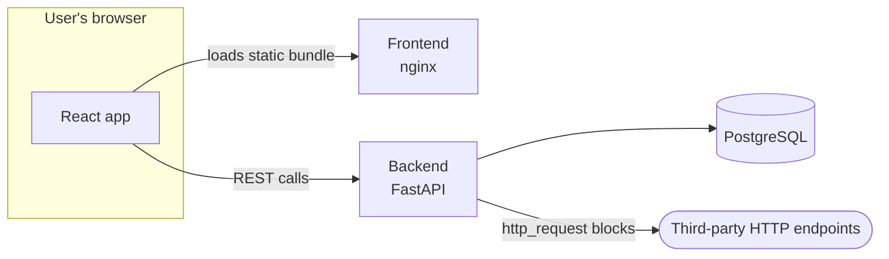
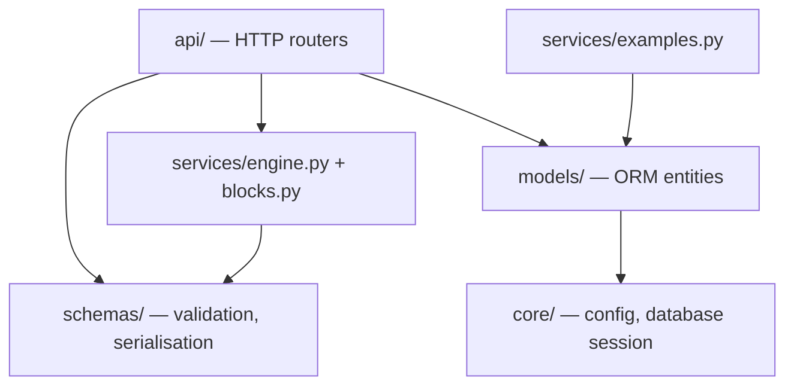

# Architecture – Micro Automation Hub

Documentation of the system's structure, split into views. Diagrams are written
in Mermaid and render directly on GitHub.

| View | Contents |
|------|----------|
| This document | Context, architectural style, component structure, cross-cutting concerns |
| [Execution engine](execution-engine.md) | The block contract, data flow, outcome classification, error handling |
| [Data model](data-model.md) | Entity relationships, table definitions, JSON payload shapes |
| [Deployment](deployment.md) | Containers, networking, configuration flow, startup ordering |
| [Decision log](decisions.md) | The significant design decisions, with alternatives and consequences |

Terminology is defined in the [glossary](../requirements/glossary.md).

---

## 1. Context

The system lets a user assemble small automations from configurable blocks and
execute them, then inspect what each block did. It is a three-tier web
application: a browser client, a stateless HTTP API, and a relational database.
The only external dependency is whatever endpoint a user's workflow chooses to
call.

Note that the browser calls the API **directly** rather than through the
frontend container — nginx serves static assets only and does not proxy. That is
why cross-origin configuration is a first-class concern rather than an
afterthought, and why the API's URL has to be known when the frontend bundle is
built. See [AD-10](decisions.md#ad-10-the-browser-calls-the-api-directly).

## 2. Architectural Style

A modular monolith with a layered backend.

The domain is small and its parts are tightly coupled in meaning: a run belongs
to a workflow, a workflow is a list of blocks, and the engine needs all of it. A
service-per-concern split would have added network boundaries, partial-failure
handling, and deployment complexity without buying independent scalability that
this workload does not need. Modularity is therefore enforced *inside* the
process, by separating responsibilities into packages with a one-directional
dependency flow.

The dependency that deliberately does **not** exist is from the execution engine
to the persistence layer. `execute_workflow` accepts a validated definition and
returns an outcome; writing that outcome to the database is the router's job.
This keeps the engine a pure function of its input, which is why all three
outcome paths can be tested exhaustively with no database at all.

The one part of `services/` that does reach for the ORM is `examples.py`, which
seeds the built-in example workflow at startup. That is a persistence task by
nature, not execution logic.

## 3. Components

### Frontend

| Module | Responsibility |
|--------|----------------|
| `api.ts` | Single point of contact with the backend; owns the shared TypeScript interfaces and normalises error responses into human-readable messages |
| `blocks.ts` | Block metadata, default configurations, and value coercion — the frontend's knowledge of the block library |
| `App.tsx` | Top-level view state: workflow list, run result, run history, and switching into the builder |
| `WorkflowBuilder.tsx` | Composition: palette, block list, reordering, test run, save/update |
| `BlockConfigEditor.tsx` | Renders the configuration controls appropriate to a block's type |
| `KeyValueEditor.tsx` | Reusable editor for string maps (HTTP headers, extracted fields) |
| `RunResult.tsx` | Per-block timeline with status, timing, logs, and output |

### Backend

| Module | Responsibility |
|--------|----------------|
| `api/workflows.py` | Routes, HTTP status mapping, and the transaction boundary |
| `schemas/workflow.py` | Block and workflow validation as a discriminated union; API response models |
| `services/blocks.py` | The five block handlers, plus path resolution and template rendering |
| `services/engine.py` | Sequential execution, outcome classification, output summarisation |
| `services/examples.py` | Idempotent seeding of the built-in example workflow |
| `models/workflow.py` | `Workflow` and `WorkflowRun` entities |
| `core/config.py` | Environment-derived settings |
| `core/db.py` | Engine, session factory, declarative base, session dependency |
| `main.py` | Application assembly, CORS, lifespan startup, health endpoints |

## 4. Cross-Cutting Concerns

### Validation

All input is validated at the HTTP boundary by Pydantic. Blocks form a
discriminated union keyed on `type`, so an unknown block type is rejected with
HTTP 422 before any execution begins, and each block type's configuration model
forbids unknown keys — a misspelled setting is an error rather than a silently
ignored field.

A consequence worth noting: because validation happens at the boundary, the
engine can assume its input is well-formed and does not re-check it.

### Error handling

Errors are separated into three kinds, which is what makes the outcome
classification meaningful:

| Kind | Raised as | Becomes |
|------|-----------|---------|
| Invalid request | Pydantic validation error | HTTP 422, no run recorded |
| Block failure | `BlockError` | Run status `failed` |
| Condition not met | `FilteredOut` | Run status `filtered` |

Anything unexpected escaping a handler is caught by the engine and recorded as a
block failure, so a defect cannot take down the API.

### Configuration

Settings come from environment variables only, with defaults aimed at local
development. There are no configuration files and no per-environment code
branches. See [deployment](deployment.md) for how values flow from `.env`
through compose into each container.

### Persistence strategy

Workflow definitions and run steps are stored as JSON columns rather than
normalised into tables. The definition's shape is the thing most likely to
change as block types are added, and normalising it would mean a migration for
every such change. Run steps are an immutable audit record that is only ever
read as a whole, so decomposing them buys nothing.

The cost is that the database cannot query inside a definition — "which
workflows call this URL?" is not an indexed question. That is an acceptable
trade at this scale and is recorded in the [decision log](decisions.md).

### Observability

Each block appends its own log lines during execution, and those lines are
persisted with the run rather than only emitted to stdout. This is what allows
the interface to explain a past run without the operator needing container
logs. The engine additionally logs filtered runs at `INFO` and failures at
`WARNING`.

## 5. Known Architectural Limitations

- **Linear data flow.** A single value passes between blocks, so branching,
  loops, and fan-out cannot be expressed.
- **Synchronous execution.** A run occupies the request for its duration.
  Long-running workflows would need a job queue.
- **No authentication, and unrestricted outbound requests.** See
  [NFR-10](../requirements/non-functional.md#nfr-10-security). The system is
  suitable for local evaluation only.
- **Schema created at startup.** No migration tool, so a model change requires
  discarding the volume.

All four are tracked in the [technical debt register](../technical-debt.md).
