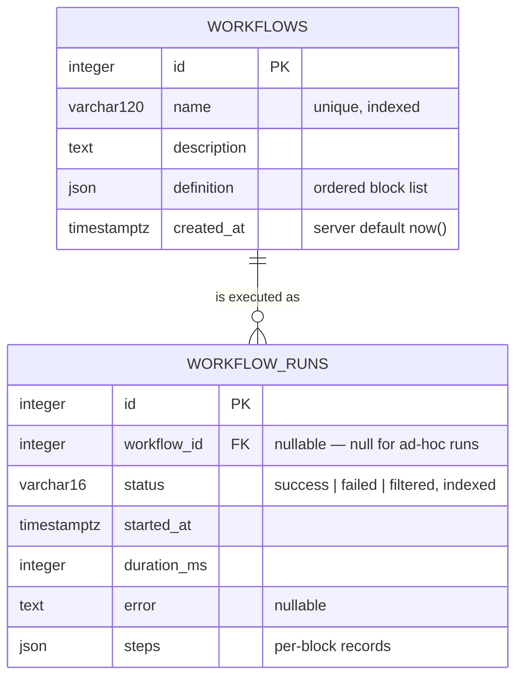

# Data Model

Two tables: saved workflows, and the immutable history of their executions.
Defined in `backend/app/models/workflow.py`.

## 1. Entity Relationships



The relationship is optional in both directions. A workflow may have no runs,
and **a run may have no workflow** — an ad-hoc run of an unsaved definition is
recorded with `workflow_id` set to null. That nullable foreign key is what lets
the builder's *Test run* share one history table with saved executions instead
of needing a parallel one.

Deleting a workflow cascades to its runs, at both the ORM level
(`cascade="all, delete-orphan"`) and the database level (`ON DELETE CASCADE`),
so history cannot outlive its parent as orphaned rows.

## 2. `workflows`

| Column | Type | Notes |
|--------|------|-------|
| `id` | integer | Primary key |
| `name` | varchar(120) | Unique and indexed; a collision returns HTTP 409 rather than a constraint error |
| `description` | text | Defaults to empty |
| `definition` | JSON | `{"blocks": [...]}`, 1–20 blocks |
| `created_at` | timestamptz | Set by the database, not the application |

`created_at` uses a server default so the timestamp comes from one clock,
regardless of which application instance inserted the row.

## 3. `workflow_runs`

| Column | Type | Notes |
|--------|------|-------|
| `id` | integer | Primary key |
| `workflow_id` | integer, nullable | Indexed; null for ad-hoc runs |
| `status` | varchar(16) | Indexed; `success`, `failed`, or `filtered` |
| `started_at` | timestamptz | Recorded by the engine when execution begins |
| `duration_ms` | integer | Whole-run wall time |
| `error` | text, nullable | Prefixed with the failing block's name |
| `steps` | JSON | One record per executed block |

Both `workflow_id` and `status` are indexed because both are used to filter
history; without them, listing a single workflow's runs would degrade into a
full scan as history accumulates.

Run rows are written once and never updated — they are an audit record.

## 4. JSON Shapes

### `workflows.definition`

```json
{
  "blocks": [
    {
      "type": "http_request",
      "name": "Fetch repository",
      "config": {
        "method": "GET",
        "url": "https://api.github.com/repos/fastapi/fastapi",
        "headers": { "Accept": "application/vnd.github+json" },
        "body": null,
        "timeout_seconds": 10
      }
    },
    {
      "type": "json_extract",
      "name": "Keep the interesting fields",
      "config": {
        "fields": {
          "repo": "full_name",
          "owner": "owner.login",
          "stars": "stargazers_count"
        }
      }
    },
    {
      "type": "filter",
      "name": "Only when popular",
      "config": { "path": "stars", "operator": "gt", "value": 1000 }
    }
  ]
}
```

### `workflow_runs.steps`

```json
[
  {
    "name": "Fetch repository",
    "type": "http_request",
    "status": "success",
    "output": { "_truncated": true, "size_chars": 48213, "preview": "..." },
    "error": null,
    "duration_ms": 214,
    "logs": [
      "GET https://api.github.com/repos/fastapi/fastapi",
      "responded 200"
    ]
  },
  {
    "name": "Only when popular",
    "type": "filter",
    "status": "filtered",
    "output": null,
    "error": "condition not met: stars gt 1000",
    "duration_ms": 0,
    "logs": ["stars (842) gt 1000 -> False"]
  }
]
```

## 5. Why JSON Rather Than Normalised Tables

A normalised alternative would give each block its own row, with typed
configuration columns or a per-type table.

**Chosen: JSON columns.** The definition's shape is the part of this system most
likely to change — every new block type introduces new configuration fields.
Normalising it would mean a schema migration per block type, and either sparse
nullable columns or a table per type. Run steps are an append-only audit record
that is always read in full, so decomposing them yields nothing.

**The cost**, stated plainly: the database cannot see inside a definition.
Questions like "which workflows call this host?" require reading and inspecting
every row in the application rather than an indexed query. At this scale that is
acceptable; at a scale where it is not, the fix is a derived index table rather
than restructuring the definition.

A secondary benefit is portability. The generic `JSON` type was chosen over
PostgreSQL's `JSONB`, which sacrifices indexing inside the document — something
already ruled out above — in exchange for the model working unchanged on SQLite.
That is what allows the API test suite to run against an in-memory database with
no PostgreSQL instance.

## 6. Schema Creation and Seeding

The schema is created by `Base.metadata.create_all()` during application
startup, and the example workflow is seeded idempotently by name immediately
afterwards. Both steps are wrapped so that an unreachable database logs a
warning instead of preventing the API from starting — the liveness endpoint must
answer even when the database is down.

**There is no migration tool.** `create_all` creates missing tables but never
alters existing ones, so a change to a model requires discarding the volume.
This is item 6 of the [technical debt register](../technical-debt.md); the remedy
is Alembic, after which the startup call should be removed.
