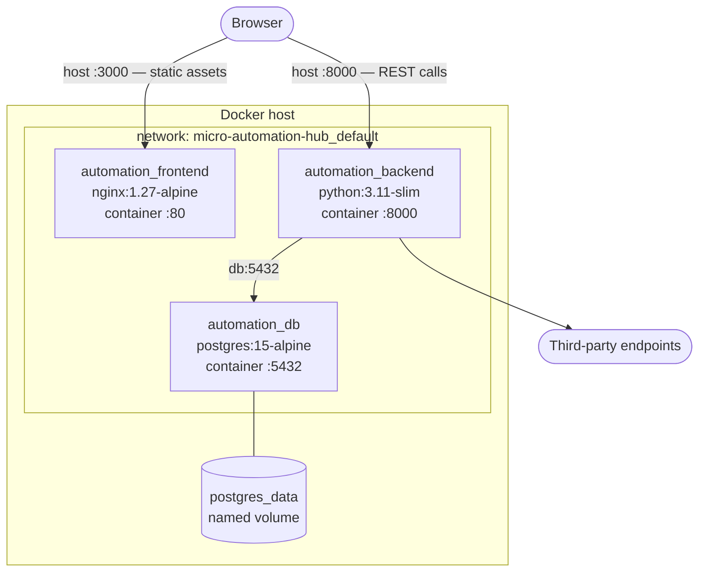
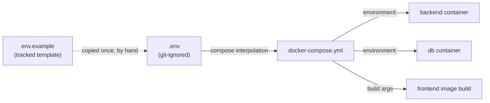
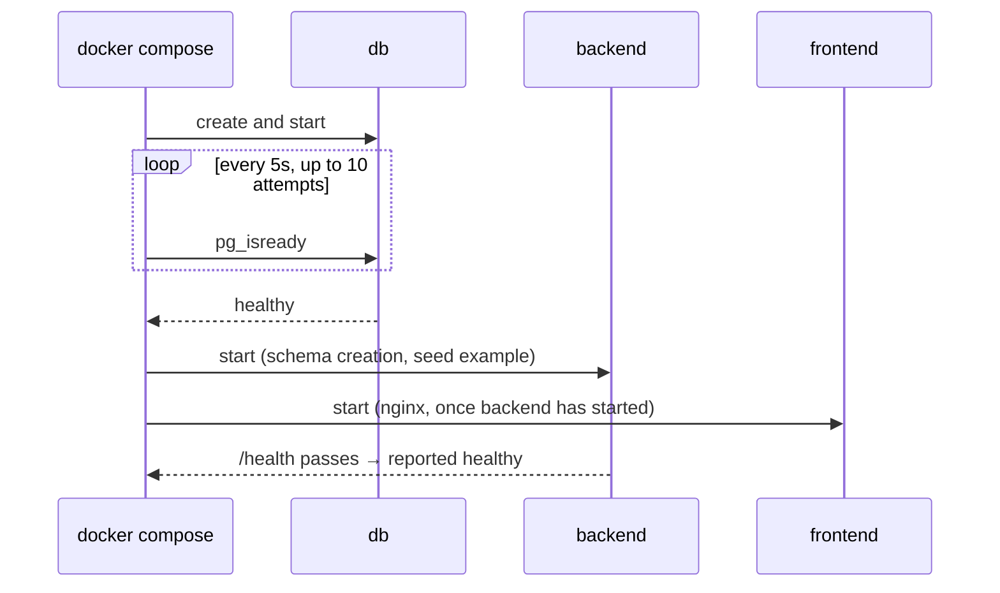

# Deployment View

Three containers orchestrated by `infrastructure/docker-compose.yml`. Operational
notes live in [deployment-notes.md](../../infrastructure/deployment-notes.md);
setup steps are in the
[installation instructions](../installation-run-instructions.md).

## 1. Runtime Topology

| Service | Image | Host port | Container port |
|---------|-------|-----------|----------------|
| `frontend` | built from `frontend/` | 3000 | 80 |
| `backend` | built from `backend/` | 8000 | 8000 |
| `db` | `postgres:15-alpine` | 5433 | 5432 |

Host ports are overridable via `FRONTEND_PORT`, `BACKEND_PORT`, and
`POSTGRES_PORT`. Postgres defaults to **5433** on the host so it does not
collide with a local installation already using 5432; inside the network it is
always `db:5432`, so the host mapping never affects the application.

The browser talks to both the frontend and the backend directly. nginx serves
static files and does not proxy the API, which is the reason cross-origin
configuration matters — see section 3.

## 2. Configuration Flow

Configuration moves in one direction, from a single file to the containers:

`env.example` is a template and is **never read by compose**, so editing it has
no effect on a running stack. Every variable has a compose-level default, which
means the stack boots without a `.env` for convenience — acceptable for local
evaluation, but it also means an operator who skips that step runs with a known
default password.

`DATABASE_URL` is assembled inside the compose file from the Postgres variables
rather than being set by hand, so the credentials exist in exactly one place and
cannot drift between the database and the backend.

## 3. Build-Time vs Runtime Configuration

This is the single most consequential deployment characteristic, and the easiest
to get wrong.

| Setting | Bound at | Changing it requires |
|---------|----------|----------------------|
| `DATABASE_URL` | runtime | restart |
| `BACKEND_CORS_ORIGINS` | runtime | restart |
| Host port mappings | runtime | restart |
| **`REACT_APP_API_URL`** | **image build** | **rebuild** |

Create React App inlines environment variables into the JavaScript bundle during
`npm run build`. `REACT_APP_API_URL` is therefore passed as a Docker build
argument, and cannot be changed by restarting the container —
`docker compose up --build` is required.

Because the browser calls the API directly at that baked-in URL, two values must
agree for a deployment to work: `REACT_APP_API_URL` must point at the backend,
and `BACKEND_CORS_ORIGINS` must include the origin the frontend is served from.
A mismatch produces a blank list of workflows and a CORS error in the browser
console, with nothing wrong in the backend logs.

## 4. Startup Ordering

`depends_on` alone waits only for a container to *start*, not to become usable,
which would let the backend race PostgreSQL's initialisation. The database
therefore declares a `pg_isready` healthcheck and the backend depends on
`condition: service_healthy`.

The backend has its own healthcheck against `/health`, so `docker compose ps`
distinguishes "container running" from "API serving". The frontend depends only
on the backend having *started*, not on it being healthy — nginx serves static
files regardless, and the browser retries its API calls on the user's next
action, so blocking the frontend on backend readiness would buy nothing.

Startup performs two database operations — schema creation and idempotent
seeding of the example workflow — both wrapped so that an unreachable database
logs a warning rather than preventing the API from starting. The liveness
endpoint must answer even when the database is down.

## 5. Image Construction

**Frontend — two stages.** Node installs dependencies with `npm ci` against the
committed lockfile and produces a static bundle; only that bundle is copied into
an nginx image. The runtime image contains no Node.js and no `node_modules`,
which is why it is roughly **75 MB** rather than the **3 GB** of the earlier
single-stage image that shipped a dev server and its dependencies.

nginx is configured to fall back to `index.html` for unknown paths, so
client-side routes survive a hard refresh, and to serve hashed assets under
`/static/` with a long cache lifetime.

**Backend — single stage.** Dependencies install from pinned requirements before
the application is copied, so the dependency layer is cached until
`requirements.txt` changes. The process runs as a non-root `appuser`.

**Build context hygiene.** `.dockerignore` files exclude `node_modules`,
virtualenvs, caches, and `.env`. Without them the frontend build context alone
is several hundred megabytes, and — more subtly — a `COPY . .` would overwrite
the container's freshly installed dependencies with the host's
platform-specific ones.

## 6. Data Durability

PostgreSQL's data directory is a named volume, `postgres_data`. Consequently:

- `docker compose down` and container recreation **preserve** data
- `docker compose down -v` **destroys** it

There is no backup mechanism and no migration tooling. Because the schema is
created at startup rather than migrated, a change to a model currently requires
destroying the volume.

## 7. Production Readiness Gaps

The stack is suitable for local evaluation and demonstration. Before any public
deployment it needs, in order of severity:

1. **Authentication**, and an outbound allow-list for the `http_request` block —
   without which the service is an open request proxy. See
   [NFR-10](../requirements/non-functional.md#nfr-10-security).
2. **TLS termination**, via a reverse proxy or platform-managed certificates.
3. **Secret management** instead of plain environment variables, and mandatory
   override of the default database password.
4. **Database migrations** and backups.
5. **A CI pipeline** that builds the images and runs both test suites.
