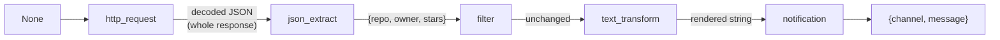
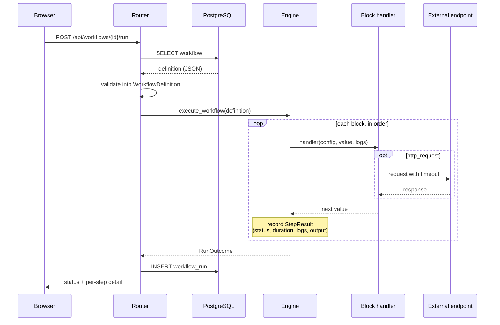
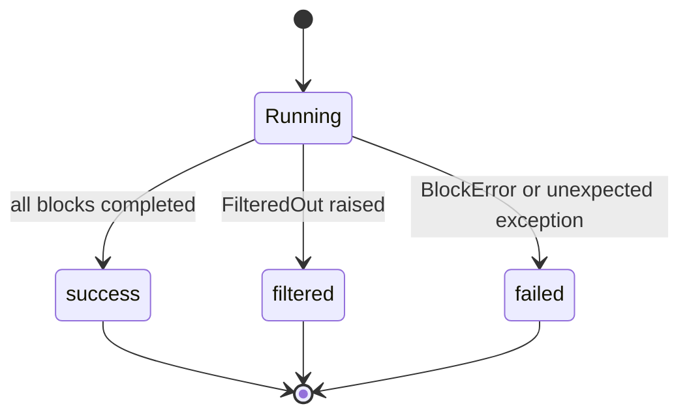

# Execution Engine

How a workflow definition becomes a recorded run. Implemented in
`backend/app/services/engine.py` with the block handlers in
`backend/app/services/blocks.py`.

## 1. The Block Contract

Every block type is a function with the same signature:

```python
handler(config, value, logs) -> value
```

- `config` — the block's validated, type-specific configuration
- `value` — whatever the previous block returned; `None` for the first block
- `logs` — a list the handler appends explanatory lines to
- returns — the value handed to the next block

Handlers signal outcomes by raising:

| Raised | Meaning | Effect on the run |
|--------|---------|-------------------|
| `BlockError` | The block could not do its job | Run ends as `failed` |
| `FilteredOut` | A condition deliberately did not hold | Run ends as `filtered` |
| anything else | A defect in the block | Caught by the engine, recorded as `failed` |

Handlers are registered in the `HANDLERS` map. Adding a block type means adding
a config model, a handler, and two registry entries — the engine is untouched.

## 2. Data Flow

Blocks form a chain, each consuming the previous output. There is no named
context and no way to reference an earlier block's result.



Two properties of this design are worth stating explicitly, because they explain
most of the engine's behaviour:

- **`filter` is a gate, not a transform.** It returns its input unchanged, so
  inserting or removing a filter never disturbs the data the following blocks
  see.
- **Templates adapt to their input.** `{input}` always refers to the whole
  incoming value, and when that value is an object its keys are addressable
  directly. This is why `notification` can be placed either straight after
  `json_extract` (using `{stars}`) or after `text_transform` (using `{input}`,
  since the value is by then a string).

The limitation is the same property viewed from the other side: a single value
in flight means conditional branching is not expressible. Recorded as item 9 of
the [technical debt register](../technical-debt.md).

## 3. Execution Sequence



A run is persisted **after** execution completes, in a single insert. There is no
progress reporting while a run is in flight; because runs are short and
synchronous, the request itself carries the result.

## 4. Outcome Classification

Every run ends in exactly one of three states.



Separating `filtered` from `failed` is a requirement rather than a convenience.
A workflow whose filter correctly decided there was nothing to do has behaved
exactly as designed; reporting that as a failure would train the user to ignore
failures.

**Blocks after the stopping point are not executed and produce no step records.**
A `filtered` or `failed` run therefore shows fewer steps than the workflow has
blocks, and the interface states this explicitly so the absence does not look
like data loss.

## 5. Error Reporting

Failure messages are written to be actionable, on the basis that these are the
strings a user actually sees when an automation misbehaves:

| Situation | Message |
|-----------|---------|
| Missing object key | `path 'owner.login' not found (missing key 'login')` |
| Descending into a scalar | `path 'a.b' not found (cannot descend into int)` |
| Bad list index | `path 'items.5' not found (bad list index '5')` |
| Unknown template placeholder | `template references unknown placeholder 'x'; available: input, stars` |
| Ordering comparison on non-numbers | `operator 'gt' needs numeric operands, got str and int` |
| Timeout | `request timed out after 10.0s` |
| HTTP error status | `endpoint returned HTTP 404` |

Listing the *available* placeholders on a template error matters more than it
might appear: the user's mistake is almost always a name they expected to exist,
so showing what does exist resolves it immediately.

On a failed run the run-level `error` field is prefixed with the failing block's
name, so the history list conveys the cause without expanding the run. A
filtered run records the unmet condition unprefixed, since the block that
stopped it is the last entry in `steps`.

## 6. Resilience

- **Timeouts** are mandatory on every HTTP request, defaulting to 10 seconds and
  validated to at most 60, so a hanging endpoint cannot stall a run forever.
- **Non-JSON responses** are passed on as `{"text": ...}` rather than failing —
  a plain-text endpoint is unusual but not an error.
- **Unexpected exceptions** are caught per block, so a handler defect degrades
  one run instead of the API process.

There is no retry logic, so a transient network failure fails the run. This is a
deliberate omission for now: retries interact with idempotency, and a blind
retry of a non-idempotent POST block would be worse than failing.

## 7. Output Summarisation

Step outputs are persisted, and an HTTP response can be arbitrarily large. Any
output exceeding **2000 characters** when JSON-encoded is replaced with:

```json
{
  "_truncated": true,
  "size_chars": 48213,
  "preview": "{\"full_name\": \"fastapi/fastapi\", \"owner\": {...}"
}
```

Values that cannot be JSON-encoded at all are replaced with a type name and a
short string preview, so an unserialisable value can never fail the insert that
records the run.

Note that summarisation affects only the **stored** output. The value passed to
the next block is always the full one, so truncation never changes what a
workflow computes.
